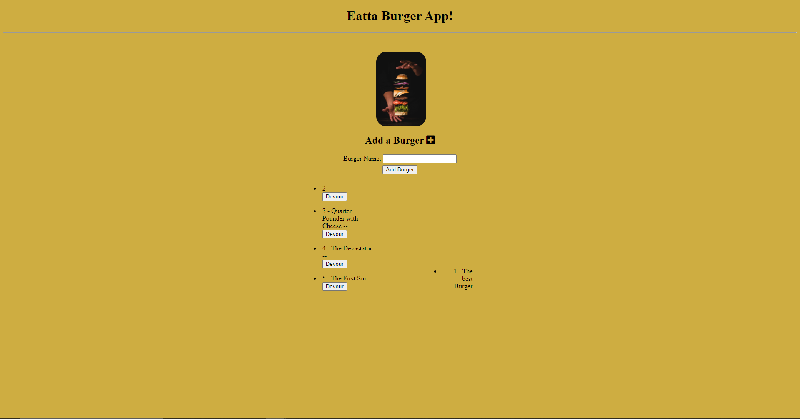

# Eatta Burger
      

## Description
   Application which shows a list of burgers, you can add burgers to the list and then devour them to add them to the devoured list. Uses express handlebars and MySQL" 

## Table of Content
   
* [Installation](#installation)
     
* [Usage](#usage)

* [Future Direction](#Future-Direction)

* [Live Screenshots](#Live-Screenshots)

* [Contributions](#Contributions)
       
* [Credits](#credits)
    
* [License](#license)
     
  

    
  
## Installation
1.  For local deployment - install node, run code "npm i" then "npm start" 
2.  Alternate Method - Click on this [Deployed Link](https://serene-forest-69610.herokuapp.com/)
  
## Usage
    This application takes in users input; creating a burger by inoutting a name (be creative). The user can choose to add as many burgers as they please. The user can click the devour button next to the burger and it will be "devoured".  

    The data being inputted by the user is stored in a MySQL database, API calls are made to pull that information and display them.  

## Future Direction
* CSS reworks for page.
* Allowing user to clear lists and view older burgers.
* Allowing user to list specific ingredients for burgers (might use a relational database structure).

### Live Screenshots

### Contributions 

    This application has an MIT license and is completely open to open source contribution! Feel free to fork and enhance the functionality and add features if you would like! 

### Changelog
    Version: 1.0: First Release 
    
## Credits
    N/A
    
## License
     MIT
      
    
## Questions
* Github : [Ezkenneth](github.com/Ezkenneth)
* E-mail : Reach me at - kennethjoeezigbo@gmail.com